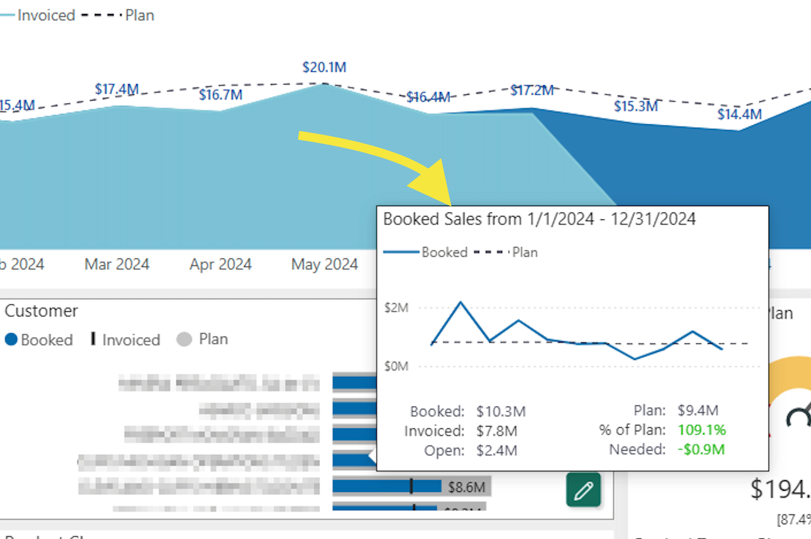

## Overview

What an excellent challenge this report was. Data was extracted from SAP into a custom built Data Warehouse. The client request was to not only see performance in dollars, but in tons as well. Within Tons, they needed to see it by Metric and US tons as well. Along with that, they needed to see a separation of closed revenue and open revenue. All of this in comparison to Revenue Plan as well. The solution was to create Switch statements in DAX, allowing the buttons to the left to flip the entire report to the desired metric definition. 

## Challenges:

This report was a challenge in itself based on what's above, but came out very successful. Switch statements allowed the functionality as requested. I also used bookmarks in the top right visual to provide a monthly and quarterly view depending on how larage the date selection was. I think the ultimately challenge I overcame here was determining an approach with numerous requests on how the report needed to function without adding additional pages and keeping the report lightning fast. 

## Custom Tooltips:

To add more insight analysis, I created a custom tooltip. When an employee hovers over the 4 different slices or categories on the bottom left, they get additional detail on how that specific product, customer, etc is performing against their individual plans. 

## Adoption:

After publishing this report, I provided a custom built adoption tool so my client could see what reports were being used. This was a top used report along with a gross margin version I built and published for them. 

