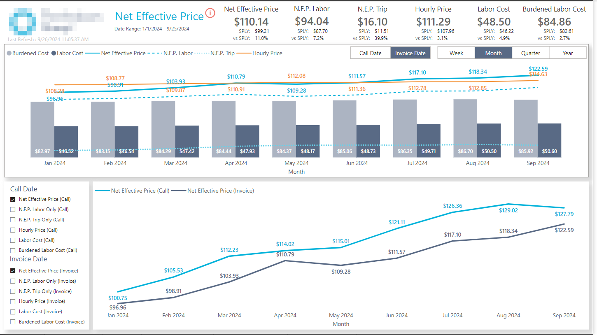
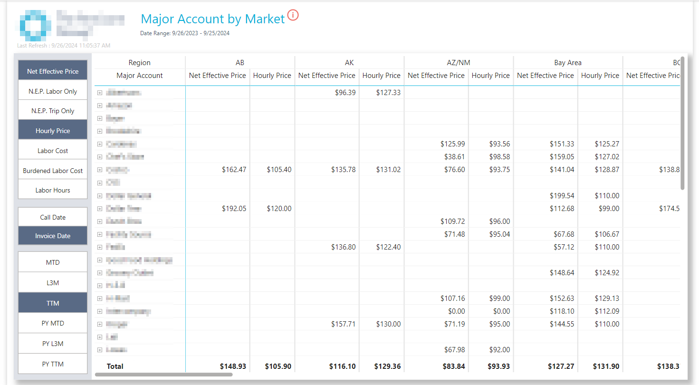
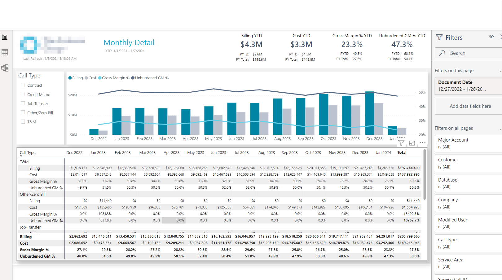

## Technologies Used:
Power BI - DAX - SQL - SSMS  

## The Client:
This client is a national HVAC company that was scaling quickly, creating a need for deeper company insights. My role was to collaborate with their technical team to create numerous reporting suites like revenue, operational reporting, marketing and pricing analysis, and others.  

## Overview:

Stakeholders had a great grasp on metrics they needed and had reporting already. The challenge? Everything was still being done the hard way and in Excel. The goal was to bring reporting to a more modern look and feel with lightning fast insights. Being new to Power BI, it was important that different reports looked and felt similar to one another. This was a great backbone to work off of and having Excel reporting made validation work streamlined. Over the course of our engagement I was able to create a Power BI App with 4-5 reporting suites, each containing anywhere from 3-8 pages.  

## Saving Time and Money:

Something I focus on when data modeling is sustainable, reusable models. We learned this team wrote a custom query for just about everything and identified that it wasn't always necessary, and took a lot of time and energy. Essentially, they weren't using their DWH. By utilizing schemas and reporting views within the DWH, we were able to create a more systematic approach the expedite report development and create consistency across departments while saving hours on hours of developement time. 

## Keep it Consistent:

I built many reports for this team. A key request was to keep a consistent look and feel. Below is a Cost Detail page and a Monthly Detail page. The reporting effort and data is very different but because it looks similar, an end user can quickly understand how they might interact with these pages with little to no guidance or direction.

