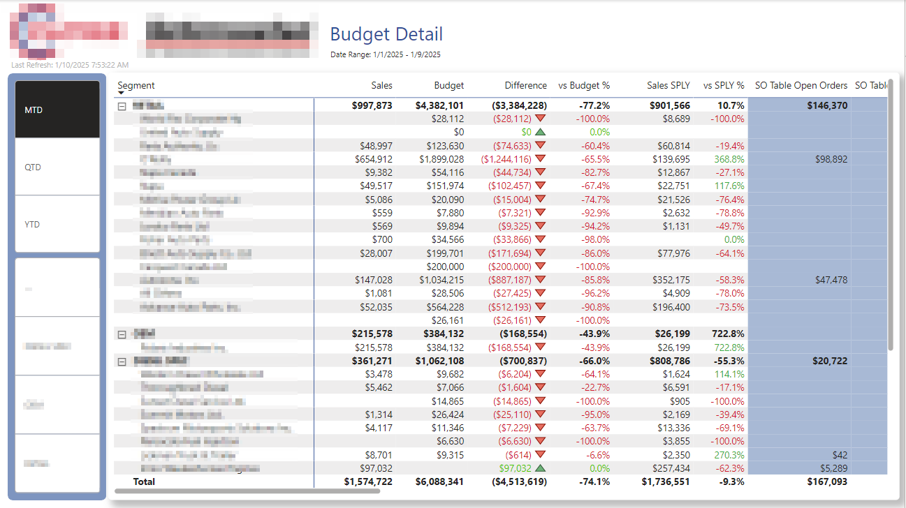

## Technologies Used:
Power BI - DAX - SQL - SSMS - Python 

## The Client:
This client operates in the automobile industry as a leading supplier and manufacturer of turbo-chargers, timing kits and engine components, with several acquired companies under its umbrella. While this report was built off Sage, we also supported reporting for their acquisitions using Acumatica and Plex ERPs.

## Overview:

The ask was simple: give sales teams and executives dynamic visibility into sales performance. The current team wasted a lot of time hunting down numbers, taking time away from doing what they do best, closing deals. The key was to find the right balance of dynamic functionality. Collaborating with different levels of the sales team hierarchy allowed me to pinpoint exactly what was needed, identify the most useful slicers and simplify how date selections are managed. 

## Process:

For this project, the data model was the ultimate challenge. Reporting came relatively easy after squaring away the model. Sage implementations vary significantly between companies, which can make modeling a challenge. In addition, the client needed to see global sales converted to USD and had not done so previously. I was able to reverse engineer how a previous consultant had modeled the data which led to a much leaner, performant data model. I used Calculation Groups to dynamically calculate MTD, QTD and YTD performance against last year and plan, and added a drill-through table for deeper insights into specific Segments or Customers.

## Currency Conversion:

I brought in a currency conversion table via API and joined it to their sales data, allowing for accurate USD values based on transaction date - instead of an average or most recent rate.

## Growth:

I mentioned the challenge of the data model above. Something I learned on this project was finding a balance between utilizing something already built to gain insight to what might be relevant, but to also not get too caught up in what's been built. It can send you down a rabbit-hole. I had to take a step back and ask: *is this how I'd build it from scratch?* That mindset shift helped me deliver a sustainable, performant, and user-friendly star schema model.