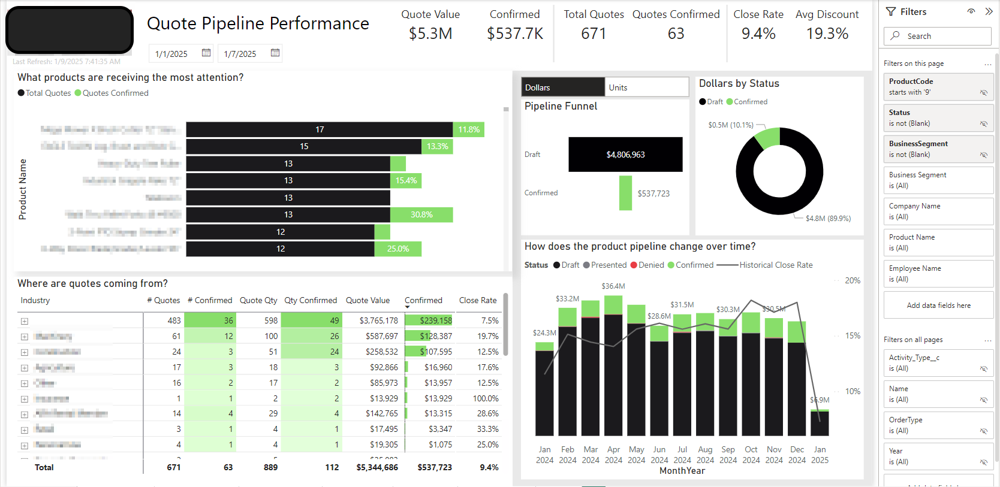
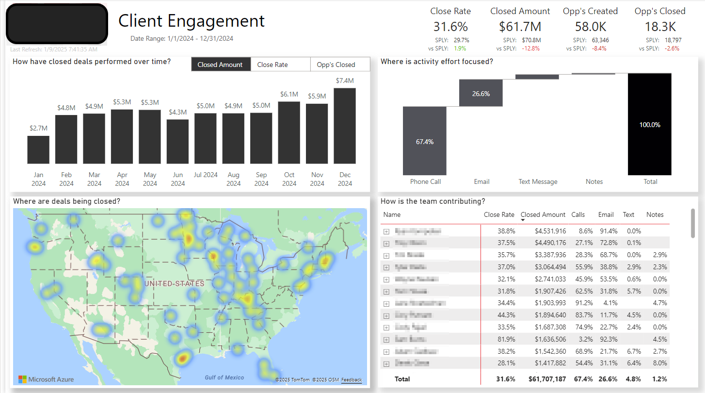

## Technologies Used:
Power BI - DAX - SQL - SSMS  

## The Client:
This client is a leading designer and manufacturer of construction equipment like skid-steers, compact tractors and landscaping tools. I worked with the CFO to create reporting out of Syspro and Salesforce so their sales teams could instantly access performance insights while on the road. 

## Overview:

Originally, teams had to log in to Syspro or Salesforce and run their own queries, digging through spreadsheets full of columns and rows. I was able to help them save time and quickly spot top priorities in a summarized view, while still having the flexibility to drill into the details. 

## Process:

The team was relatively new to Power BI. My job? Show them the art of the possible. While collaborating and gathering requirements, I took time to demo how Power BI works. We used just about every trick in the book while keeping the reporting experience smooth and sleek. Using calc groups, bookmarks, drill downs and drill throughs, this was a very featureful reporting suite and was a blast to work on.

On the data model side, mapping wasn't there. I was able to collaborate with stakeholders to bucket a lot of detail. Seeing every employee, every product SKU and every individual customer was too much. We were able to bring that up a few levels and summarize groupings using native ID's as well as `CASE WHEN` statements to give dynamic views of their data at the right leve, something they didn't have before.

## The Learning Curve:

To support learning a new tool, I created training videos and a Demo/Training report with pop-ups explaining key Power BI features and functionality. Examples include Drillthroughs, Tooltips, Date selections, what cross filtering was and how to drill down on different layers of visuals etc. This improved report adoption dramatically.

